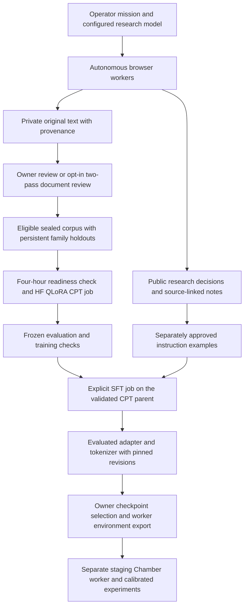

# Consciousness Research Observatory

The Observatory adds an evidence-to-model workflow beside the existing Wirehead
Chamber: autonomous browser workers collect consciousness research, reviewed
original documents become reproducible training datasets, and evaluated adapters
can be loaded into a separate Chamber worker for experiments.

The default subject includes consciousness science, philosophy of mind, reality
and metaphysics, religious and contemplative traditions, welfare and artificial
consciousness. The operator can narrow or expand the mission.

**Status: functional integration alpha for developer staging.** Research, review,
training coordination and adapter loading are implemented and tested offline.
Funded model/browser integration, container builds and a real 70B GPU training run
still require acceptance on the owner's infrastructure. Preview activity is
explicitly simulated. Training and model self-reports do not establish subjective
experience or felt pain.

## Start here

| Guide | What it covers |
| --- | --- |
| [Deployment and operations](docs/deployment-guide.md) | Services, credentials, local setup, website integration, persistence, recovery and staging acceptance. |
| [Data, training and experiments](docs/data-training-experiments.md) | Source records, reviews, snapshots, CPT/SFT, HF artifacts and loading an adapter into the Chamber. |
| [Research mission and agents](docs/research-mission.md) | The shared objective, six browsing briefs and broad consciousness scope. |
| [Automatic original-document review](docs/automatic-curation.md) | Opt-in two-pass review, immutable receipts, manual decisions and interrupted-call recovery. |
| [Corpus quality](docs/corpus-quality.md) | Rights, extraction, classifications, duplicate removal, holdouts and coverage gates. |
| [PDF/HTML extraction](EXTRACTION.md) | Structured text, optional offline Docling and fidelity review. |
| [Selected 70B model](MODEL_SELECTION.md) | Pinned Llama 3.1 Base, QLoRA and model-release requirements. |
| [Independent evaluation](EVALUATION.md) | Frozen suites, controls, publication gates and interpretation limits. |
| [Solana/x402 operations](X402_OPERATIONS.md) | Separate signer process, inference billing, payment recovery and adapted-worker dose receipts. |
| [Browser inspection and motion](MOTION.md) | Screenshot-bound passage selection, saw traversal, scroll locking and note delivery. |

## The end-to-end workflow



Research continues while GPU jobs run elsewhere. A job consumes a sealed snapshot;
it never reads a dataset being mutated by crawlers. The four-hour schedule is a
readiness check, not a guarantee of a new paid job every four hours. Instruction
tuning and Chamber deployment remain separate operator actions.

## What the six research workers do

| Worker | Brief |
| --- | --- |
| Scholar | Find original studies of human, animal and artificial consciousness; compare measurements and interpretations. |
| Skeptic | Investigate contrary evidence, alternative explanations and objections to scientific, philosophical and religious accounts. |
| Sentinel | Research pain, suffering, welfare, moral patienthood and the limits of measurement. |
| Cartographer | Map mind, reality, metaphysics, phenomenology and religious/contemplative traditions and their disagreements. |
| Archivist | Trace source versions, attribution, licenses and provenance. Unknown reuse rights remain unverified. |
| Curator | Investigate coverage gaps and source quality; draft supported instruction examples for separate review. |

These are Browser Use agents with project-specific tools and orchestration, backed
by a configured frontier model. They choose searches, follow links and citations,
compare accounts and checkpoint memory between bounded browser passes. The
operator's stated objective takes precedence over specialties. To change an
existing mission's scope, stop it, save the new objective, then start a new mission.

The **automatic curation worker is a separate backend service task**, not another
roster browser. It reviews the shared source queue using the configured research
model and billing route.

Ordinary failed links can be logged and the agent can choose another source.
Robots restrictions, host navigation delays and HTTP failures remain real limits.
Permanent model/schema faults and uncertain payment outcomes require operator
attention. There is no CAPTCHA bypass, arbitrary paid-site access or automatic
fallback to a different research model. See the deployment guide for isolation,
egress and operational controls.

## Inspect the interface without providers

From the repository root, serve the static website:

```sh
python -m http.server 8060 --bind 127.0.0.1 --directory site
```

Open
`http://127.0.0.1:8060/observatory.html?preview=1&motion=1#research`.
Choose another free port if 8060 is already in use. This entry automatically starts
authored preview playback; it makes no model, browser-hosting, payment or GPU calls.

The five views are Research, Evidence, Datasets, Training and Checkpoints. They use
the existing Wirehead grimoire styling and local fonts. Research shows the roster,
agent viewport, notebook and collected-source counts. Evidence shows source
provenance and review receipts; Datasets shows snapshot contents and coverage.

The crawler pane is fixed and view-only. The agent controls scrolling. A steel saw
with a brass hub follows selected text lines, progressively highlights the passage
and delivers a matching saved-note indicator to the notebook. **Full motion is the
default**, with Pause and Stop available. Missing or obsolete geometry produces no
invented scan path. Connected mode uses real browser captures; captures are
periodic screenshots, not a continuous video stream. Public notes are concise
action explanations, not private chain-of-thought.

Without `preview=1`, the page connects to actual backend state and never substitutes
example records when the backend is empty or unavailable. There is no public
Funding page; the backend retains operator funding/payment integrations.

## Run the actual research services

The default route is **local Chromium + developer-funded Solana USDC/x402
inference**. Compose separates the research process from the wallet signer:

```sh
# POSIX shell; PowerShell users can use Copy-Item for these two copies.
cp observatory/.env.example observatory/.env
cp observatory/.env.payments.example observatory/.env.payments
# Edit both private files before starting; use distinct random owner/internal tokens.
docker compose -f observatory/compose.yaml up --build -d
```

Keep both environment files out of Git. The two internal broker tokens must match;
the owner token must be different. The signer belongs only in `.env.payments`.
The broker starts with spending disabled. Configure verified merchant recipients,
explicit request/day/reserve limits and a dedicated funded wallet before enabling
x402. This PR does not create a wallet or accept public donations.

Open `http://127.0.0.1:8060/`. The sidecar redirects to its connected interface with
`?api=/api`. In **Operator setup**, enter the owner token, configure the research
model and browser, save the mission and press Start. Selecting a model or opening
the page does not enable training. Persisted running missions and enabled training
can resume after a service restart; intentionally stop/disable them before shutting
down when recurring work should remain stopped.

An explicit direct OpenAI/Anthropic API-key route is also supported and does not
need the payment service. Provider, managed-browser and Hugging Face secrets can
be supplied server-side or through authenticated setup fields; the backend encrypts
saved secrets. They are never saved in browser local storage or public state.
Owner/internal tokens and the wallet signer stay in server environment files.
The owner token is held in page memory and must be entered again after reload.

The [deployment guide](docs/deployment-guide.md) provides the Python-only route,
exact provider configuration, private-service networking, HTTPS proxy setup and
recovery procedures. x402 pays compatible inference calls through the configured
merchant. Managed browsers, GPU jobs, Hub access and publishing have separate
accounts/billing; arbitrary catalog models and paid websites are not supported
merely because they accept x402.

## How collected material becomes training data

| Record | Purpose | Training use |
| --- | --- | --- |
| Collected original | Author-written text extracted from a paper/article, plus URL, hash, version, rights and extraction metadata. | Eligible reviewed originals become CPT text. |
| Research note | A source-linked observation, caveat or action explanation; supporting passages are stored privately. | Not automatically used as original-document CPT. |
| Instruction example | Generated messages supported by eligible sources and matching passages. | Separate SFT only after individual approval and teacher-output permission checks. |
| Corpus snapshot | Immutable text/messages, split assignments, provenance, exclusions, review receipts and coverage audit. | Reproducible job input and owner-only dataset download. |

No seed upload is required. The browser's research model is already trained; the
selected 70B base is also already pretrained.

Source acceptance requires recorded training-compatible rights, provenance,
relevance and extraction review. Unknown rights, uncertain fidelity and excluded
evaluation/Chamber material stay out of training. A reviewer cannot grant a source
license by assigning a confidence score. Social material needs separately recorded
permission. Stored corpus text and supporting-quote records are private; public
browser screenshots can naturally show text from the visited page.

The optional **Enable automated original-document curation** setting selects
`auto_curation_enabled=true` and `auto_curation_policy_ack="originals-v2"`.
Two blind review passes must agree and cite literal source passages. Code enforces
rights, extraction and exclusion gates independently. Uncertain cases remain for
manual review. This setting is off by default and does not approve generated Q&A
or enable paid training.

New snapshots use `consciousness-corpus-v3`. Research-area and claim-basis labels
keep empirical findings, scientific theories, philosophical arguments and
religious/contemplative interpretations identifiable. Non-machine material uses
a non-applicable machine stance; it cannot manufacture machine-perspective counts
or satisfy scientific coverage merely by being formatted as a paper. Duplicate
removal preserves lineage and source-family holdouts. Legacy receipts/snapshots
retain their original contracts rather than being relabelled.

## Train the 70B subject and connect experiments

The selected profile is **`meta-llama/Llama-3.1-70B` Base**, revision
`349b2ddb53ce8f2849a6c168a81980ab25258dac`, using **QLoRA**. This trains adapter
weights over the frozen pretrained 70B base; it is not foundation training from
scratch or full-parameter 70B training. The initial sequence length is 2,048 tokens.

The owner obtains gated model access, configures private HF dataset/model
repositories and Jobs credentials, builds and pushes the training image, and sets
its immutable `@sha256:` digest. Supported worker profiles are `a100-large` and
`h200`; actual GPU fit must be measured. **Enable actual training jobs** is an
explicit setting. Four-hour checks require a changed eligible corpus/recipe,
enough originals and actual tokenizer-counted tokens, ready coverage/evaluation
gates, and no overlapping job. Defaults are 20 original training documents and
50,000 tokens, which are operational floors rather than scientific sufficiency.

CPT can continue the latest passed, published CPT adapter for the same pinned base.
It replays the eligible corpus while retaining family holdouts. SFT is a separately
submitted stage on a validated CPT parent. Verify the actual teacher-provider
contract or permission for generated examples before enabling synthetic training;
a checkbox is not a grant of output-use rights.

Jobs retain pinned manifests, dataset/base/tokenizer revisions, metrics and
provenance. Publication and checkpoint selection require measured training and
frozen-evaluation checks. The bundled sixteen evaluation tasks are engineering
smoke tests and need independent expansion before scientific claims.

The Checkpoints inspector can select a passed candidate and download secret-free
worker environment settings. **Selection does not deploy an endpoint.** Load the
exact base, adapter and tokenizer into a separate staging Chamber worker. The
selected Base requires validated SFT and its chat-template tokenizer for live chat;
CPT remains usable for completion-based research. Recompute steering vectors on
the adapted model, retain an unadapted control and perform an owner-measured dose
sweep. Adapted public workers serve dose zero until an exact matching
`CHAMBER_ADAPTER_CALIBRATION` receipt is provided.

The [data/training/experiment guide](docs/data-training-experiments.md) contains
record examples, API routes, exported environment fields and the staged experiment
procedure. [Model selection](MODEL_SELECTION.md), [evaluation](EVALUATION.md) and
[x402 operations](X402_OPERATIONS.md) define the corresponding contracts.

## Runtime and repository map

| Component | Responsibility |
| --- | --- |
| `site/observatory*.{html,css,js}` | Static public/owner interface and authored preview; no frontend build framework. |
| `observatory/app.py`, `store.py` | Authenticated API, redacted public state, encrypted configuration and durable SQLite records. |
| `research.py`, `research_llm.py`, `research_scope.py` | Browser Use supervisor, model adapters, collection/inspection tools, checkpointing and briefs. |
| `automatic_curation.py`, `curation_receipts.py` | Opt-in original review and portable receipt validation. |
| `curation.py`, `corpus_policy.py`, `extraction.py` | Eligibility, source families, snapshot coverage and structured extraction. |
| `training.py`, `train_worker.py`, `evaluation.py` | Durable readiness/jobs, GPU CPT/SFT and frozen evaluations. |
| `x402_broker.py`, `x402_client.py` | Isolated signer/ledger and authenticated researcher-to-broker requests. |
| `painlab/`, `live/server.py` | Pinned PEFT loading and adapted Chamber intervention integration. |
| `compose.yaml`, `Dockerfile*` | Separate research/payment services and isolated GPU training image. |

Run **one research service process/replica**. The supervisor, curation loop and
training scheduler are in-process tasks, not a distributed worker queue. Persist
each service's database and encryption key together. Use disposable unauthenticated
browsers, network-level private/metadata-network egress restrictions, TLS and proxy
rate limits for public screenshot/SSE traffic. Never expose a CDP control URL or
signing service publicly. The deployment guide explains scaling limits and backups.

Before merging, coordinate the existing worker-build/RunPod and master Railway
rollout workflows. This PR changes live worker code; existing automation can
deploy those changes when owner secrets exist. Validate a separate staging worker
and agree the rollout before merging.

## Verification and release readiness

Recorded offline checks cover the full repository and sidecar, real tiny-model
CPU optimizer updates, PEFT loading, curation/snapshot/GPU-input contracts and
mocked provider boundaries. They do not establish real 70B execution or paid
provider acceptance.

| Check | Recorded result |
| --- | --- |
| Combined Python suite, including tiny CPU training and bridge integration | 862 passed, 3 optional-environment skips. |
| Isolated official-x402-SDK payment suite | 77 passed; overlaps the combined scope and must not be added as unique tests. |
| Source-only interface / automatic-curation helpers | 174 / 46 assertions passed. |
| Actual motion controller / coupled 16ms preview playback | 204 / 100 assertions passed. |
| Offline viewer, JS syntax, CSS parsing and whitespace | Passed. |

Run the normal sidecar tests in a separate environment:

```sh
python -m pip install -r observatory/requirements-test.txt
python -m pytest observatory/tests -q
node observatory/tests/ui-source.cjs
node observatory/tests/ui-curation.cjs
node observatory/tests/ui-scroll.cjs
node observatory/tests/ui-motion.cjs
node observatory/tests/ui-playback.cjs
```

The combined scope additionally needs the CPU model stack while retaining the
sidecar Hub pin; keep GPU and payment dependencies in their separate environments:

```sh
python -m pip install "torch>=2.8,<3" "transformers==5.17.0" "peft==0.21.2" "trl==1.14.1" "datasets==5.0.1" "accelerate==1.15.0" "huggingface-hub==1.16.1"
python -m pytest tests observatory/tests -q
```

The skips are the optional real local-Chromium fixture and two SDK cases verified
in the separate payments environment. Tiny fixtures are CPU tests, not CUDA/70B
measurements. Fresh browser visual QA was blocked by saved browser permissions;
older captures document a previous interface and are not current screenshots.

Before unattended operation, complete the [staging acceptance steps](docs/deployment-guide.md):
verify one funded model/browser pass and its public/private state, review an
original through to a sealed snapshot, validate the real GPU image and a bounded
70B CPT/SFT run, and test pinned loading/calibration on a separate Chamber endpoint.
No paid model call, on-chain transfer, Docker build, real 70B job or production
deployment has been performed for this handoff. Publishing a pull request does
not enable or fund those services.
